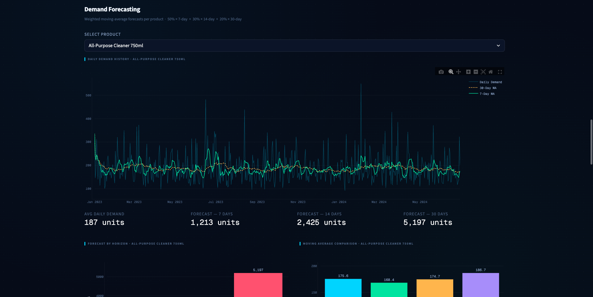

# Smart Inventory Replenishment Dashboard

An AI-assisted Streamlit dashboard for retail inventory replenishment, demand forecasting, reorder point analysis, and inventory risk classification.

## Project Overview

The **Smart Inventory Replenishment Dashboard** is a data analytics portfolio project designed to support better retail inventory decisions. It helps identify products that may be at risk of stockout, products that may be overstocked, and products that require replenishment based on historical sales patterns and simple forecasting logic.

The project combines data analytics, business intelligence, inventory management logic, dashboard design, and structured prompt engineering.

## Business Problem

Small retail businesses often face two common inventory problems:

1. **Stockouts** — high-demand products run out before replenishment arrives.
2. **Overstocking** — slow-moving products occupy storage space and tie up working capital.

Many businesses make reorder decisions based on intuition rather than structured data. This project addresses that problem by using sales data, forecasting logic, and inventory rules to support smarter replenishment decisions.

## Project Objective

The objective of this project is to build an interactive dashboard that helps users:

- Monitor sales performance
- Forecast short-term product demand
- Identify critical stock risks
- Detect overstocked products
- Calculate reorder points
- Estimate suggested reorder quantities
- Generate plain-English business insights

## Key Features

- Executive KPI overview
- Monthly revenue trend analysis
- Category-level revenue breakdown
- Top product performance analysis
- Product-level demand forecasting
- Moving average comparison
- Inventory risk classification
- Safety stock and reorder point logic
- Suggested reorder quantity calculation
- Rule-based business insight summary
- Interactive filters for date, category, region, and store

## Dashboard Sections

### 1. Executive Overview

Shows high-level KPIs including total revenue, total profit, units sold, active SKUs, critical stock products, reorder-soon products, and overstocked products.

### 2. Sales Performance

Visualizes revenue trends, category contribution, top products by revenue, and top products by units sold.

### 3. Demand Forecasting

Allows users to select a product and review its demand history, moving averages, and forecasted demand for the next 7, 14, and 30 days.

### 4. Inventory Risk

Classifies products into inventory status categories such as Critical Stock, Reorder Soon, Healthy Stock, Overstocked, and Slow Moving.

### 5. Business Insight Summary

Generates rule-based plain-English business insights from calculated metrics. No external AI API is used in the dashboard.

## Dataset

This project uses a realistic synthetic retail inventory dataset generated for portfolio and learning purposes.

The dataset includes:

- Date
- Product ID
- Product name
- Category
- Supplier
- Unit price
- Unit cost
- Units sold
- Sales revenue
- Current stock
- Lead time
- Reorder cost
- Holding cost
- Region
- Store ID

## Tools and Technologies

- Python
- Pandas
- NumPy
- Plotly
- Streamlit
- VS Code
- GitHub
- Structured prompt engineering

## Forecasting Approach

The project uses simple and explainable moving-average forecasting techniques. The purpose is not to build a complex machine learning model, but to demonstrate how historical demand patterns can support practical inventory decisions.

Forecasting metrics include:

- Average daily demand
- Standard deviation of daily demand
- 7-day moving average
- 14-day moving average
- 30-day moving average
- Forecasted demand for the next 7, 14, and 30 days

## Inventory Replenishment Logic

### Safety Stock

Safety Stock = Standard Deviation of Daily Demand × Square Root of Lead Time

### Reorder Point

Reorder Point = Average Daily Demand × Lead Time + Safety Stock

### Suggested Reorder Quantity

Suggested Reorder Quantity = Forecasted 30-Day Demand - Current Stock + Safety Stock

If the suggested reorder quantity is negative, it is set to zero.

## Inventory Status Categories

| Status | Meaning |
|---|---|
| Critical Stock | Current stock is at or below safety stock |
| Reorder Soon | Current stock is below the reorder point |
| Healthy Stock | Stock level is sufficient for expected demand |
| Overstocked | Current stock is significantly higher than forecasted demand |
| Slow Moving | Product demand is in the bottom range compared with other products |

## Prompt Engineering Role

This project was developed using structured prompt engineering as part of an AI-assisted development workflow. AI assistance was used for:

- Project planning
- Dataset generation
- Data cleaning logic
- Forecasting logic
- Inventory rule design
- Streamlit dashboard development
- UI improvement
- Debugging
- Documentation support

The analytical structure, business problem framing, testing, review, and final project organization were guided and reviewed manually.

## Folder Structure

smart-inventory-replenishment-dashboard/
├── data/
│   ├── raw/
│   │   └── retail_inventory_sales.csv
│   └── processed/
│       ├── cleaned_inventory_sales.csv
│       ├── product_demand_forecast.csv
│       └── inventory_recommendations.csv
├── src/
│   ├── data_generator.py
│   ├── data_cleaning.py
│   ├── forecasting.py
│   └── inventory_logic.py
├── dashboard/
│   └── app.py
├── assets/
│   └── dashboard_screenshot.png
├── README.md
├── prompt_engineering_log.md
├── requirements.txt
└── .gitignore

## How to Run the Project Locally

### 1. Clone the repository

git clone https://github.com/shajidp1998/smart-inventory-replenishment-dashboard.git

cd smart-inventory-replenishment-dashboard

### 2. Create a virtual environment

python3 -m venv venv

source venv/bin/activate

### 3. Install dependencies

pip install -r requirements.txt

### 4. Run the data pipeline

python3 src/data_generator.py

python3 src/data_cleaning.py

python3 src/forecasting.py

python3 src/inventory_logic.py

### 5. Run the dashboard

streamlit run dashboard/app.py

## Key Business Insights

The dashboard helps identify:

- Products that require urgent replenishment
- Categories with concentrated stockout risk
- Overstocked products that may need promotion or reduced ordering
- Slow-moving SKUs that may require review
- Products with strong revenue contribution
- Estimated procurement requirements based on suggested reorder quantities

## Limitations

This project is a portfolio demonstration and should not be treated as a production inventory system.

Key limitations include:

- Synthetic data rather than real company data
- Simple moving-average forecasting
- No live database connection
- No supplier API integration
- No automated purchase order generation
- No real-time inventory updates

## Future Improvements

Possible improvements include:

- Use real transactional sales data
- Add SQL database integration
- Add advanced forecasting models
- Include supplier performance analysis
- Add product-level seasonality detection
- Build automated reorder alerts
- Add cost optimization logic
- Deploy the dashboard publicly using Streamlit Cloud

## Screenshot

## Live Dashboard

[View the live dashboard](https://smart-inventory-replenishment-dashboard.streamlit.app/)

## Author

**Shajid H. Plabon**  
Aspiring Data Analyst | Business Intelligence | Prompt Engineering | Python Dashboard Development
